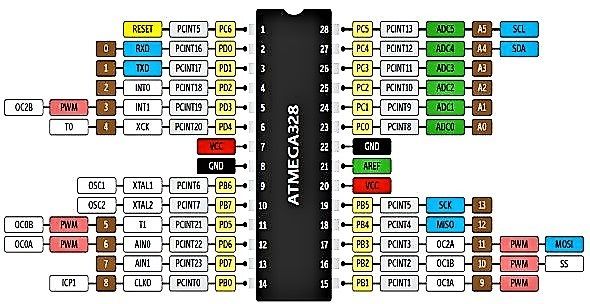

# Automated-Safety-Stand
Automated safety stand for motor bikes


## Target Microcontroller Unit: ATmega328P
* **Datasheet :** https://ww1.microchip.com/downloads/en/DeviceDoc/Atmel-7810-Automotive-Microcontrollers-ATmega328P_Datasheet.pdf
* **Product Description Page :** https://www.microchip.com/en-us/product/ATmega328P


<p align="center">

</p>

> *The high-performance Microchip picoPower® 8-bit AVR® RISC-based microcontroller combines 32 KB ISP Flash memory with read-while-write capabilities, 1024B EEPROM, 2 KB SRAM, 23 general purpose I/O lines, 32 general purpose working registers, three flexible timer/counters with compare modes, internal and external interrupts, serial programmable USART, a byte-oriented Two-Wire serial interface, SPI serial port, a 6-channel 10-bit A/D converter (8-channels in TQFP and QFN/MLF packages), programmable watchdog timer with internal oscillator, and five software selectable power saving modes. The device operates between 1.8-5.5 volts.By executing powerful instructions in a single clock cycle, the device achieves throughputs approaching one MIPS per MHz, balancing power consumption and processing speed.*


### External intrrupts to identify the moment of switch on: 11.1 Interrupt Vectors in ATmega328P Datasheet 

- 
```
2 0x002     INT0 External interrupt request 0 - PD2
3 0x0004    INT1 External interrupt request 1 - PD3
```


## References

1. [ATmega Interface](https://www.electronicwings.com/avr-atmega/interfaces)
2. [MPU6050 (Gyroscope + Accelerometer + Temperature) interface with AVR ATmega16](https://www.electronicwings.com/avr-atmega/mpu6050-gyroscope-accelerometer-temperature-interface-with-atmega16)
3. [The MPU6050 Explained](https://mjwhite8119.github.io/Robots/mpu6050)
